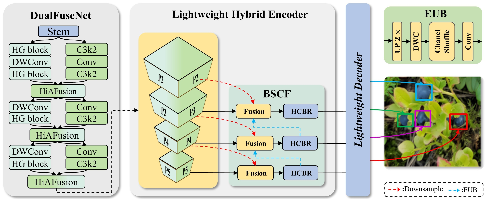

# <div style="text-align: center;">ForestBerryNet: A Dual-Backbone Architecture with Hierarchical Attention Fusion for Efficient Forest Berry Detection</div>




## Introduction 
ForestBerryNet is a lightweight dual-backbone architecture designed for efficient forest berry detection, tailored for deployment on resource-constrained platforms such as drones and edge devices.

This repository hosts the source code, pre-trained models, and configuration files for the ForestBerryNet model, which integrates CSPDarknet and HGNetV2 backbones with a Hierarchical Attention Fusion (HiAFusion) module to enhance multi-scale feature representation. The model also incorporates a Lightweight Hybrid Encoder (with Efficient Up-convolution Block and Heterogeneous Convolutional Branch Refinement) and a Lightweight Decoder optimized via grouped convolutions, ensuring a balance between detection accuracy and computational efficiency.

### Recommended Environment

- [x] torch 3.10.14
- [x] torchvision 0.17.2+cu121

```python
pip install pypi
pip install timm==1.0.7 thop efficientnet_pytorch==0.7.1 einops grad-cam==1.4.8 dill==0.3.8 albumentations==1.4.11 pytorch_wavelets==1.3.0 tidecv PyWavelets opencv-python -i https://pypi.tuna.tsinghua.edu.cn/simple
pip install -e .
```
## Dataset
Thanks to the Riz team for providing the dataset, you can download the dataset used for WildB-YOLO training from the following link 
**Hugging Face:** [Wild Berry image dataset collected in Finnish forests and peatlands using drones)](https://huggingface.co/datasets/FBK-TeV/WildBe)
```
@article{riz2024wild,
  title={Wild Berry image dataset collected in Finnish forests and peatlands using drones},
  author={Riz, Luigi and Povoli, Sergio and Caraffa, Andrea and Boscaini, Davide and Mekhalfi, Mohamed Lamine and Chippendale, Paul and Turtiainen, Marjut and Partanen, Birgitta and Ballester, Laura Smith and Noguera, Francisco Blanes and others},
  journal={arXiv preprint arXiv:2405.07550},
  year={2024}
}
```
